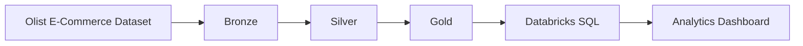
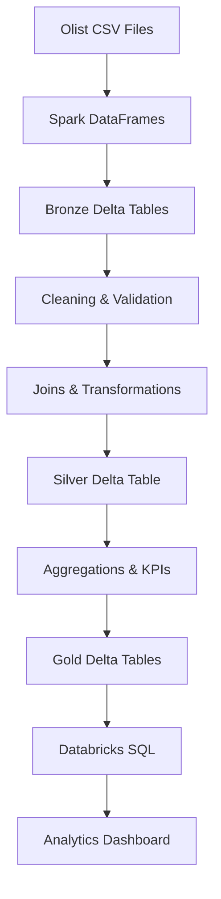
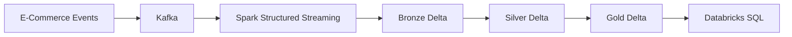
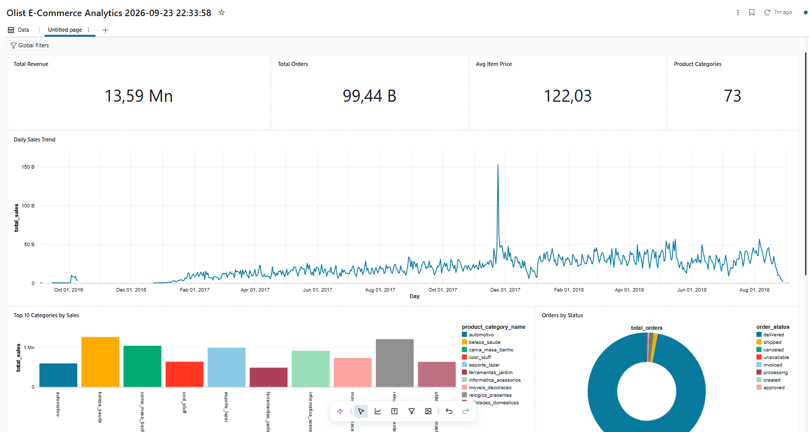

# Databricks E-Commerce Data Platform

An end-to-end data engineering project built with Apache Spark and Databricks using the Olist Brazilian E-Commerce dataset.

## Project Goal

Build a practical data platform that demonstrates how raw e-commerce data can be ingested, transformed, stored and exposed for analytics using Spark and Databricks.

The project follows a **Medallion Architecture**:



## Dataset

This project uses the **Olist Brazilian E-Commerce Public Dataset**.

The dataset contains multiple related datasets representing an e-commerce platform, including:

- Orders
- Customers
- Products
- Order Items
- Payments
- Reviews
- Sellers
- Geolocation
- Product Category Translation

For the current pipeline, the following datasets are used:

```text
orders
customers
products
order_items
payments
```

## Architecture

### Current Pipeline

The currently implemented pipeline is a batch-oriented Bronze → Silver → Gold workflow.



### Target Streaming Architecture

Streaming capabilities are planned as a later stage of the project.



## Medallion Architecture

### Bronze

The Bronze layer stores raw source data in Delta format with minimal transformation.

```text
Olist CSV
    ↓
Spark DataFrame
    ↓
Bronze Delta
```

### Silver

The Silver layer contains cleaned and enriched data.

Current transformations include:

- Duplicate handling
- Null validation
- Derived date columns
- Customer joins
- Product joins
- Order item joins
- Payment aggregation

The payment data is aggregated by `order_id` before joining to prevent row multiplication.

### Gold

The Gold layer contains business-oriented analytical datasets.

Current Gold datasets:

```text
daily_sales
category_sales
order_status
```

Examples of metrics:

- Total revenue
- Total orders
- Average item price
- Sales by day
- Sales by product category
- Orders by status

## Analytics Dashboard

The Gold layer is exposed through Databricks SQL and visualized with a Databricks dashboard.

The dashboard currently contains:

- Total Revenue
- Total Orders
- Average Item Price
- Product Category Count
- Daily Sales Trend
- Top 10 Product Categories by Sales
- Orders by Status

### Dashboard Preview



## Technology Stack

- Python
- Apache Spark
- PySpark
- Databricks
- Delta Lake
- Apache Kafka
- Spark Structured Streaming
- Databricks SQL
- Git / GitHub

## Project Structure

```text
databricks-ecommerce-data-platform/
│
├── README.md
│
├── notebooks/
│   ├── 02_bronze_ingestion
│   ├── 03_silver_transformation
│   └── 04_gold_analytics
│
├── docs/
│   └── dashboard.png
│
├── src/
├── tests/
└── data/
```

## Current Status

### Implemented

- [x] Databricks project setup
- [x] Olist dataset ingestion
- [x] Bronze Delta layer
- [x] Silver transformations
- [x] Gold analytical datasets
- [x] Unity Catalog tables
- [x] Databricks SQL analytics
- [x] Analytics dashboard

### Planned

- [ ] Incremental processing
- [ ] Spark performance optimization
- [ ] Data quality checks
- [ ] Databricks Jobs / Workflows
- [ ] Kafka integration
- [ ] Structured Streaming
- [ ] Event-time processing
- [ ] Watermarking
- [ ] Streaming analytics

## Project Status

🚧 In Development