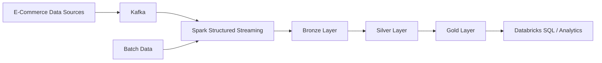
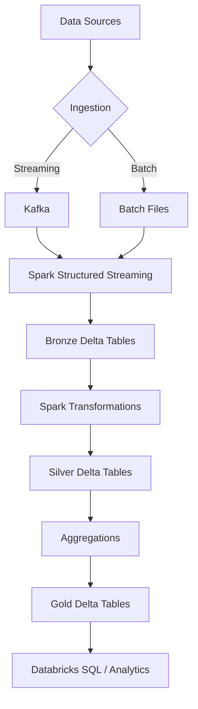
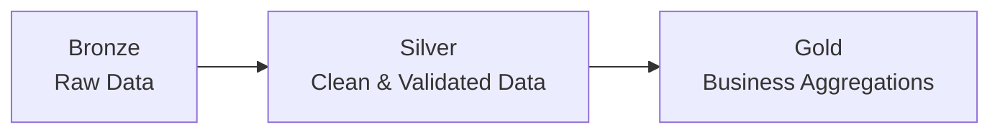

# Databricks E-Commerce Data Platform

A data engineering project built with Apache Spark and Databricks.

## Goal

Build an end-to-end data pipeline for processing e-commerce events
using Apache Spark, Databricks, Delta Lake and Kafka.

## Architecture

### Data Flow

### Medallion Architecture

## Technology Stack

- Python
- Apache Spark
- PySpark
- Databricks
- Delta Lake
- Apache Kafka
- Spark Structured Streaming
- SQL
- Git / GitHub

## Project Scope

The project will cover:

- Batch data processing with Apache Spark
- Streaming data processing with Spark Structured Streaming
- Bronze / Silver / Gold data architecture
- Delta Lake tables
- Data transformations and aggregations
- Event-time processing
- Windowing
- Watermarking
- Spark performance optimization
- Databricks Jobs
- Basic data quality checks

## Project Status

🚧 In Development